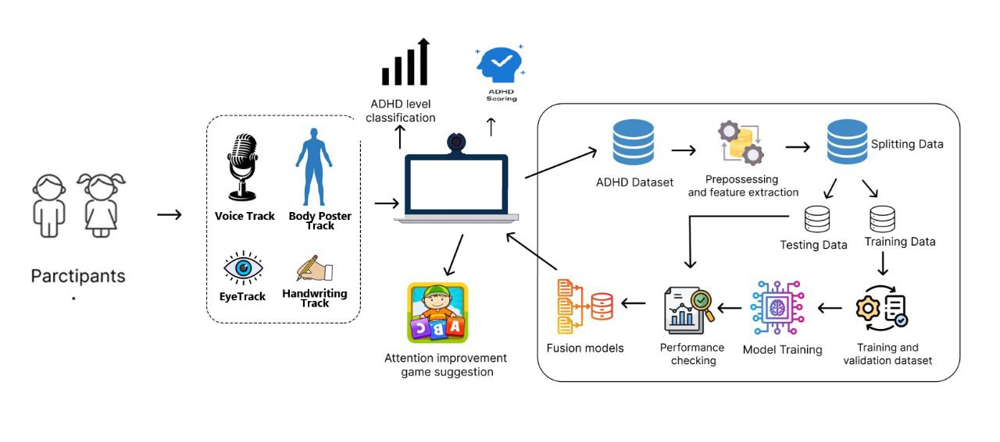
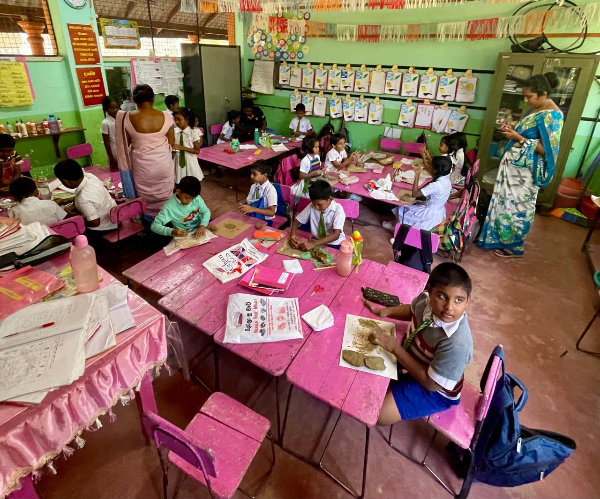

# 🧠 AI-Driven Multimodal ADHD Screening & Attention Enhancement Platform

---

## 🔍 Project Overview

This project presents an **AI-driven, multimodal ADHD screening and attention enhancement platform** designed for **children aged 6–10**, with a strong focus on **Sri Lankan and Sinhala-speaking contexts**.

The system integrates **speech analysis**, **handwriting assessment**, **body posture and hyperactivity tracking**, and **eye-tracking–based visual attention analysis** to provide an **objective, scalable, and non-invasive ADHD screening solution**.

> ⚠️ **Important Note**  
> This system is intended for **SCREENING purposes only** and **does not provide a medical diagnosis**.  
> Results must be interpreted by qualified healthcare professionals.

---

## ❗ Problem Statement

Traditional ADHD diagnosis relies heavily on:
- Lengthy clinical interviews  
- Subjective behavioral observations  
- Expensive and inaccessible tools (e.g., EEG, lab-grade eye trackers)  

These approaches are often:
- Time-consuming  
- Costly  
- Difficult to scale for schools and community settings  
- Not child-friendly  

As a result, there is a **critical need for an accessible, engaging, and objective ADHD screening solution**, particularly in **resource-limited regions such as Sri Lanka**.

---

## 🎯 Project Objectives

- Develop a **multimodal AI-based ADHD screening framework**
- Enable **early identification** using non-invasive behavioral data
- Support **Sinhala-speaking children** through culturally adapted tasks
- Integrate **screening and attention enhancement** within a single platform
- Ensure **privacy, ethical compliance, and child-friendly interaction**

---

## 📝 Project Description

This project proposes an AI-driven, multimodal screening platform to support the **early identification of ADHD-related behavioral patterns** in children aged **6–10 years**.  

Multiple non-invasive data sources—including **speech**, **handwriting**, **posture**, and **eye-tracking**—are combined to generate an objective ADHD risk assessment and to recommend appropriate attention improvement activities.

---

## 🏗️ System Architecture

The platform follows a **modular, service-oriented architecture**, where each behavioral analysis component operates independently while contributing to a **unified ADHD risk assessment**.

### 🔄 High-Level Workflow
1. Children interact with **web-based tasks and games**
2. Multimodal data is captured (audio, video, gaze, handwriting)
3. Features are extracted and preprocessed
4. Machine learning models analyze behavioral patterns
5. Results are fused into an **ADHD risk score**
6. **Attention-improvement games** are recommended

### 📌 System Architecture Diagram

  

---

## 📁 Architecture Folder Contents & Evidence

The `Architecture/` folder contains **system design documentation and real-world evidence** related to this project.

### 📐 Included Materials
- System architecture diagram
- School-based data collection photographs
- Lady Ridgeway Hospital data collection photographs
- Ethical clearance documentation

These materials are included **strictly for academic verification purposes**.

---

## 🧪 Data Collection & Ethical Approval

### 📍 Data Collection Locations
- Selected primary schools  
- **Lady Ridgeway Hospital for Children, Sri Lanka**

### 🏥 Ethical Clearance
- Ethical approval was formally obtained from **Lady Ridgeway Hospital**
- Parental consent was obtained prior to data collection
- All activities adhered to:
  - Child safety guidelines  
  - Research ethics standards  
  - Data privacy and confidentiality requirements  

### 📸 Ethical Clearance Evidence

  

---

## 🧩 Core System Components

### 1️⃣ Speech-Based ADHD Screening
- Analysis of **Sinhala speech** during reading tasks  
- Extraction of **acoustic features** (MFCCs, pitch, jitter, shimmer)  
- Extraction of **linguistic features**  
- Classification using ML models (Random Forest, XGBoost, etc.)  
- Output of **probability-based ADHD indicators**

---

### 2️⃣ Handwriting-Based ADHD Analysis
- Capture of handwriting dynamics (stroke patterns, pressure, timing)
- Identification of motor control and attention irregularities
- Support for early indicators of ADHD-related fine motor challenges

---

### 3️⃣ Vision-Based Posture & Hyperactivity Detection
- Webcam-based posture and motion tracking
- Detection of excessive movement, restlessness, and impulsivity
- Extraction of motion-based behavioral biomarkers

---

### 4️⃣ Eye-Tracking & Visual Attention Assessment
- Browser-based eye tracking using standard webcams
- Gamified assessment tasks:
  - Prosaccade
  - Antisaccade
  - Memory-guided saccade
- Extraction of gaze features (fixation duration, saccade latency, gaze entropy)
- Classification of attention patterns using machine learning

---

## 🧠 Machine Learning Pipeline

### 🔹 Processing Steps
- Data preprocessing and feature extraction
- Train–test split with cross-validation

### 🔹 Models Utilized
- Logistic Regression  
- Support Vector Machine (SVM)  
- Random Forest and Extra-Trees  
- CNN + LSTM (experimental)

### 🔹 Evaluation Metrics
- Accuracy  
- AUC–ROC  
- Sensitivity and Specificity  

---

## 🛠️ Technology Stack

### 🎨 Frontend
- React.js  
- Tailwind CSS  
- HTML5 Canvas / WebGL  

### ⚙️ Backend
- FastAPI (Python)  
- RESTful API architecture  

### 🤖 AI / Machine Learning
- Python  
- Scikit-learn  
- TensorFlow / PyTorch (experimental)

### 🔊 Audio & Signal Processing
- Librosa  
- FFmpeg  
- PyDub  
- Praat-Parselmouth  

### 🧠 Natural Language Processing
- NLTK  
- spaCy  

### 👁️ Computer Vision & Eye Tracking
- OpenCV  
- MediaPipe  
- WebGazer.js  

### 📊 Data Handling
- NumPy  
- Pandas  
- SciPy  

### 🔄 Version Control
- Git  
- GitHub  

---

## 🎮 Demo Games & Data Collection Tools

To support multimodal data collection and system validation, the following **web-based demo tools** were developed:

- 👁️ Eye-Tracking Simulation  
  https://eye-tracking-simulation.vercel.app  

- 🧍 Pose & Hyperactivity Detection Games  
  https://adhd-poses-detection-games.vercel.app  

- 🎙️ Speech-Based ADHD Data Collection  
  https://gb8222.github.io/speechBase  

- ✍️ Handwriting Data Collection Tool  
  https://handwriting-data-collection.vercel.app  

---

## 📁 Component Demonstration & Individual Contributions

Each team member independently developed and tested their assigned system component.

- Short demonstration and progress videos were recorded
- Videos illustrate component functionality, data flow, and feature extraction
- Materials are shared via Google Drive for evaluator access

🔗 **Drive Link:**  
https://drive.google.com/drive/folders/1qcCdg-zrMsUxbjDFOUXC_EKRq9lXjNYP?usp=sharing

---

## 🔐 Privacy, Ethics & Security

- No raw video or facial images are stored
- Only derived behavioral features are retained
- Participant identities are **pseudonymized**
- Secure data handling and encrypted storage
- Explicit parental consent is mandatory
- System design follows ethical guidelines for child data protection

---

## ⚠️ Disclaimer

This system is developed **for academic research and screening purposes only**.  
It **does not replace professional medical diagnosis** and should be used solely as a supportive screening tool.

---
